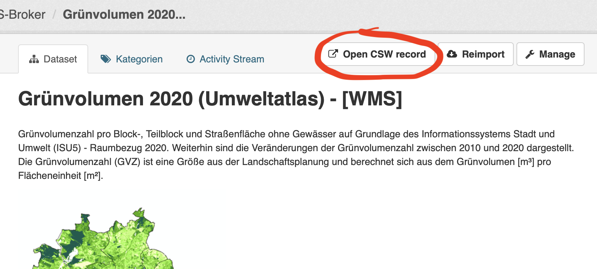

# ckanext-fisbroker

[](https://github.com/berlinonline/ckanext-fisbroker/actions)
[](http://codecov.io/github/berlinonline/ckanext-fisbroker?branch=master)


This plugin belongs to a set of plugins for the _Datenregister_ – the non-public [CKAN](https://ckan.org) instance that is part of Berlin's open data portal [daten.berlin.de](https://daten.berlin.de).

`ckanext-fisbroker` is an extension of the CWS Harvester from [ckanext-spatial](https://github.com/ckan/ckanext-spatial), intended to harvest Berlin's geoportal [FIS-Broker](https://www.stadtentwicklung.berlin.de/geoinformation/fis-broker/). It mainly adapts the harvesting to extract metadata conforming to the [Berlin Open Data Schema](https://datenregister.berlin.de/schema/berlin_od_schema.json).

The plugin implements the following core CKAN interfaces:

- [IBlueprint](https://docs.ckan.org/en/latest/extensions/plugin-interfaces.html#ckan.plugins.interfaces.IBlueprint)
- [IClick](https://docs.ckan.org/en/latest/extensions/plugin-interfaces.html#ckan.plugins.interfaces.IClick)
- [IConfigurer](https://docs.ckan.org/en/latest/extensions/plugin-interfaces.html#ckan.plugins.interfaces.IConfigurer)
- [ITemplateHelpers](https://docs.ckan.org/en/latest/extensions/plugin-interfaces.html#ckan.plugins.interfaces.ITemplateHelpers)

It also implements **IHarvester** and **ISpatialHarvester**, which are defined in the [ckanext-harvest](https://github.com/ckan/ckanext-harvest) and [ckanext-spatial](https://github.com/ckan/ckanext-spatial) extensions.

- [IHarvester](https://github.com/ckan/ckanext-harvest#the-harvesting-interface)
- [ISpatialHarvester](https://docs.ckan.org/projects/ckanext-spatial/en/latest/harvesters.html#customizing-the-harvesters)

## Requirements

This plugin has been tested with CKAN 2.9.10 (which requires Python 3).

## Custom Configuration Options

A number of custom configuration options can be set for the harvester:

- `import_since`: Sets a filter on the query to CSW to retrieve only records that were changed after a given date. Specified either as an ISO8601 date `YYYYMMDDTHH:MM:SS`, or as one of the following keywords:

  - `last_error_free`: The `import_since` date will be the date of the last error free harvest job (excluding reimport jobs).
  - `big_bang`: no date constraint: retrieve all records
- `timeout`: Time in seconds to retry before allowing a timeout error. Default is `20`.
- `timedelta`: The harvest jobs' timestamps are logged in UTC, while the harvest source might use a different timezone. This setting specifies the delta in hours between UTC and the harvest source's timezone (will influence the timestamp retrieved by `last_error_free`). Default is `0`.

## Reimport

The plugin adds functionality to reimport individual or all datasets that were harvested by the FIS-Broker Harvester.
Reimport means running a harvest job with fetch and import stage for a specific set of datasets.
There are different ways to trigger a reimport.

### Reimport Button

Every dataset that was harvested by the FIS-Broker Harvester has a **Reimport** button next to the **Edit** button in the upper right-hand corner of the dataset page.
Clicking will trigger a reimport job for that dataset.


### "Open CSW record"-Button

Every dataset that was harvested by the FIS-Broker Harvester has an **Open CSW record** button next to the **Reimport** button in the upper right-hand corner of the dataset page.
Clicking will open the full CSW record for this dataset on its original server.



### Command Line Interface

The plugin also defines a `fisbroker` command for the `ckan` cli tool, to list or reimport one or more datasets, as well as some other tasks.
You can get the documentation for the command as follows (the location of the `--config` parameter depends on your setup):

```
(default) :/usr/lib/ckan/default$ ckan --config /etc/ckan/default/ckan.ini fisbroker

Usage: ckan fisbroker [OPTIONS] COMMAND [ARGS]...

  Command-line actions for the FIS-Broker harvester

Options:
  --help  Show this message and exit.

Commands:
  harvest-objects              Show all harvest objects with their CSW-
                               guids...

  last-successful-job          Show the last successful job that was not a...
  list-datasets                List the ids and titles of all datasets...
  list-datasets-berlin-source  Show all active datasets for which the...
  list-sources                 List all instances of the FIS-Broker...
  reimport-dataset             Reimport the specified datasets.
```

The command outputs JSON to STDOUT, e.g.:

```
(default) :/usr/lib/ckan/default$ ckan --config /etc/ckan/default/ckan.ini fisbroker list-sources

listing all instances of FisbrokerPlugin ...
[
  {
    "id": "89f414c8-5ebf-4ac4-90c3-1b06f403768d",
    "url": "https://fbinter.stadt-berlin.de/fb/csw",
    "title": "FIS Broker",
    "description": "",
    "config": "{\n  \"import_since\": \"2021-10-04\", \n  \"timeout\": 120\n}",
    "created": "2018-05-30 15:03:51.047337",
    "type": "fisbroker",
    "active": true,
    "user_id": "",
    "publisher_id": "",
    "frequency": "MANUAL",
    "next_run": "2021-09-22 23:00:04.205522",
    "publisher_title": "",
    "status": {
      "job_count": 492,
      "next_harvest": "Not yet scheduled",
      "last_harvest_request": "None"
    }
  }
]

```

## Copying and License

This material is copyright © 2016 – 2024  [BerlinOnline GmbH](https://berlinonline.net).

This extension is open and licensed under the GNU Affero General Public License (AGPL) v3.0.
Its full text may be found at:

http://www.fsf.org/licensing/licenses/agpl-3.0.html
