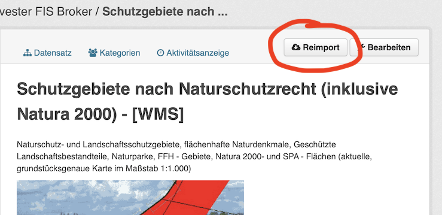

# ckanext-fisbroker


[](https://github.com/berlinonline/ckanext-fisbroker/actions)
[](http://codecov.io/github/berlinonline/ckanext-fisbroker?branch=master)

This plugin belongs to a set of plugins for the _Datenregister_ – the non-public [CKAN](https://ckan.org) instance that is part of Berlin's open data portal [daten.berlin.de](https://daten.berlin.de).

This is an extension of the CWS Harvester from [ckanext-spatial](https://github.com/ckan/ckanext-spatial), intended to harvest the Berlin Geoportal [FIS-Broker](https://www.stadtentwicklung.berlin.de/geoinformation/fis-broker/). It mainly adapts the harvesting to extract metadata conforming to the [Berlin Open Data Schema](https://datenregister.berlin.de/schema/berlin_od_schema.json).


## Configuration

- `import_since`: Sets a filter on the query to CSW to retrieve only records that were changed after a given date. Specified either as an ISO8601 date `YYYYMMDDTHH:MM:SS`, or as one of the following keywords:

  - `last_error_free`: The `import_since` date will be the date of the last error free harvest job (excluding reimport jobs).
  - `big_bang`: no date constraint: retrieve all records
- `timeout`: Time in seconds to retry before allowing a timeout error. Default is `20`.
- `timedelta`: The harvest jobs' timestamps are logged in UTC, while the harvest source might use a different timezone. This setting specifies the delta in hours between UTC and the harvest source's timezone (will influence the timestamp retrieved by `last_error_free`). Default is `0`.

## Reimport

The plugin adds functionality to reimport individual or all datasets that were harvested by the FIS-Broker Harvester.
Reimport means running a harvest job with fetch and import stage for a specific set of datasets.
There are different ways to trigger a reimport.

### Reimport Button

Every dataset that was harvested by the FIS-Broker Harvester has a **Reimport** button next to the **Edit** button in the upper right-hand corner of the dataset page.
Clicking will trigger a reimport job for that dataset.



### Paster Command

The plugin also defines a `fisbroker` paster command to list or reimport one or more datasets, as well as some other tasks.
You can get the documentation for the paster command as follows:

```
(default) user:/usr/lib/ckan/default/src/ckan# paster --plugin=ckanext-fisbroker fisbroker
Usage: paster fisbroker [options] 

Actions for the FIS-Broker harvester

      fisbroker list_sources
        - List all instances of the FIS-Broker harvester.

      fisbroker [-s {source-id}] list_datasets
        - List the ids and titles of all datasets harvested by the
          FIS-Broker harvester. Either of all instances or of the
          one specified by {source-id}.

      fisbroker [-s|-d {source|dataset-id}] [-o {offset}] [-l {limit}] reimport_dataset
        - Reimport the specified datasets. The specified datasets are either
          all datasets by all instances of the FIS-Broker harvester (if no options
          are used), or all datasets by the FIS-Broker harvester instance with
          {source-id}, or the single dataset identified by {dataset-id}.
          To reimport only a subset or page through the complete set of datasets,
          use the --offset,-o and --limit,-l options.

      fisbroker [-s {source-id}] last_successful_job
        - Show the last successful job that was not a reimport job, either
          of the harvester instance specified by {source-id}, or by
          all instances.
```

## Copying and License

This material is copyright © 2016 – 2022  [BerlinOnline Stadtportal GmbH & Co. KG](https://berlinonline.net).

It is open and licensed under the [MIT License](LICENSE).